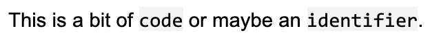

# Alfred Workflow: Inline code formatting for Google Docs

Some [doc-writing apps](https://paper.dropbox.com/) have nice inline formatting for bits of `code` or `identifiers` using markdown-style backticks (`). Unfortunately Google Docs does not, so you have to click through the menus to set the font to something monospace and maybe add a background highlight.

This Alfred workflow does that for you, triggered by a keyboard shortcut. I use ⌘⌥C (Cmd-Option-C), but you have to set it yourself after importing the workflow (double-click the Hotkey box at the top). The workflow uses keyboard shortcuts to navigate through the Google Docs menus, setting the font to "Courier New" and the background highlight color to "light gray 3".

## Screenshots
### Dropbox Paper

### Google Docs

